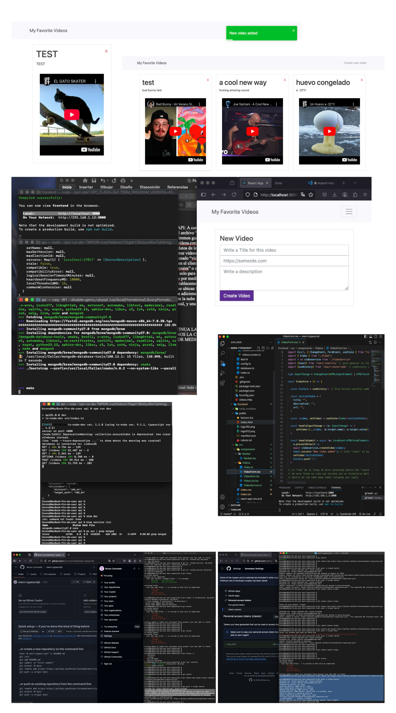

# Aplicación MERN con TypeScript (CRUD de Videos)

Aplicación web fullstack desarrollada con el stack MERN (MongoDB, Express, React y Node.js) utilizando TypeScript tanto en el backend como en el frontend.

El proyecto implementa una API REST que permite gestionar una colección de videos (crear, listar, actualizar y eliminar), los cuales son consumidos desde una interfaz en React.

---

## 🚀 Descripción del proyecto

Esta aplicación permite almacenar y gestionar una lista de videos favoritos, incluyendo información descriptiva y enlaces a contenido externo (por ejemplo, YouTube).

El sistema está basado en una arquitectura cliente-servidor:

* 🔧 Backend: API REST construida con Node.js, Express y TypeScript
* 🎨 Frontend: Aplicación en React con TypeScript
* 🗄️ Base de datos: MongoDB (instalación local)

---

## 🧱 Tecnologías utilizadas

* MongoDB
* Express
* React
* Node.js
* TypeScript
* Mongoose
* Morgan
* Dotenv
* Cors
* React Router DOM

---

## 📌 Funcionalidades

* Crear videos
* Listar videos
* Editar videos
* Eliminar videos
* Consumo de API REST desde el frontend
* Navegación entre vistas

---

## 📸 Capturas

### Vista resumen

### Vista principal (PENDIENTE)

 🟡

👉 https://www.youtube.com/watch?v=TU_VIDEO_ID

---

## ⚙️ Instalación

### 1. Clonar el repositorio

git clone https://github.com/Bruno-Coronado/mern-typescript.git
cd mern-typescript

📌 Nota: Ampliar como en el punto 2 para mejorar entendimiento (PENDIENTE) 🟡

### 2. 🔧 Configurar el Backend (API)

cd api
npm install
Crear archivo de variables de entorno

Dentro de la carpeta api, crea un archivo llamado .env y agrega el siguiente contenido:

PORT=3000
MONGO_URI=mongodb://localhost/mern-typescript

📌 Nota: Estas variables de entorno permiten configurar el puerto en el que se ejecuta el servidor y la conexión a la base de datos sin exponer información sensible directamente en el código fuente. 🟢

### 3. 🎨 Configurar el Frontend (React)

cd ../frontend
npm install

📌 Nota: Ampliar como en el punto 2 para mejorar entendimiento (PENDIENTE) 🟡

### 4. 🗄️ Configurar la Base de datos (MongoDB)

Asegúrate de tener MongoDB instalado y ejecutándose localmente:

mongod

📌 Nota: Ampliar como en el punto 2 para mejorar entendimiento (PENDIENTE) 🟡

---

## ▶️ Ejecución del proyecto

### 🔧 Backend (API REST)

cd api
npm install
npm run dev

### 🎨 Frontend (React)

cd frontend
npm install
npm start

La aplicación estará disponible en:
http://localhost:3000

📌 Nota: Los comandos de ejecución se definen en el archivo package.json de cada módulo:

// Backend (api/package.json)
"scripts": {
  "dev": "ts-node-dev src/index.ts",
  "build": "tsc"
}
// Frontend (frontend/package.json)
"scripts": {
  "start": "react-scripts start",
  "build": "react-scripts build"
}

---

## 🧩 Arquitectura del proyecto

### Backend (API REST)

* `src/index.ts` → punto de entrada
* `src/app.ts` → configuración de Express
* `src/routes/` → definición de endpoints
* `videos.controller.ts` → lógica de negocio
* `Video.ts` → modelo de datos
* `database.ts` → conexión a MongoDB

Dependencias principales:

* express → servidor backend
* mongoose → base de datos
* morgan → logging
* dotenv → variables de entorno
* cors → comunicación entre servicios

---

### Frontend (React)

* `components/navbar` → navegación
* `components/videos` → lógica principal
* `VideoList` → listado de videos
* `VideoForm` → creación de videos

Uso de `react-router-dom` para gestión de rutas.

---

## 🔐 Variables de entorno

Crear archivo `.env` en el backend:

PORT=3000
MONGO_URI=tu_conexion_mongodb

---

## ⚙️ Configuración TypeScript

Compilación:

tsc

Ejecución en desarrollo:

npm run dev

Configuración en `tsconfig.json`:

* target: es6
* rootDir: ./src
* outDir: ./dist

---

## 🔄 Flujo de funcionamiento

1. El usuario interactúa con el frontend
2. El frontend realiza peticiones HTTP a la API
3. El backend procesa la solicitud
4. Se realizan operaciones en MongoDB
5. La API devuelve la respuesta
6. La interfaz se actualiza dinámicamente

---

## 🧠 Notas del proyecto

Proyecto desarrollado como práctica de arquitectura MERN con TypeScript, enfocado en demostrar la integración completa entre frontend, backend y base de datos.

---

## 📄 Estado del proyecto

Proyecto funcional orientado a portafolio.

Posibles mejoras:

* Autenticación de usuarios
* Deploy en la nube
* Mejoras de UI/UX
